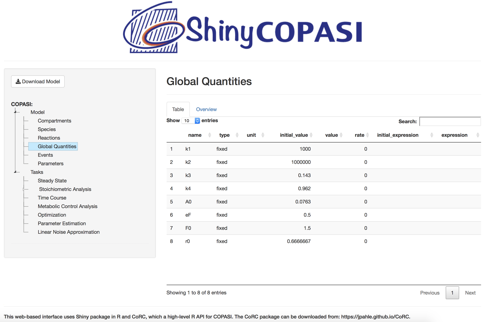
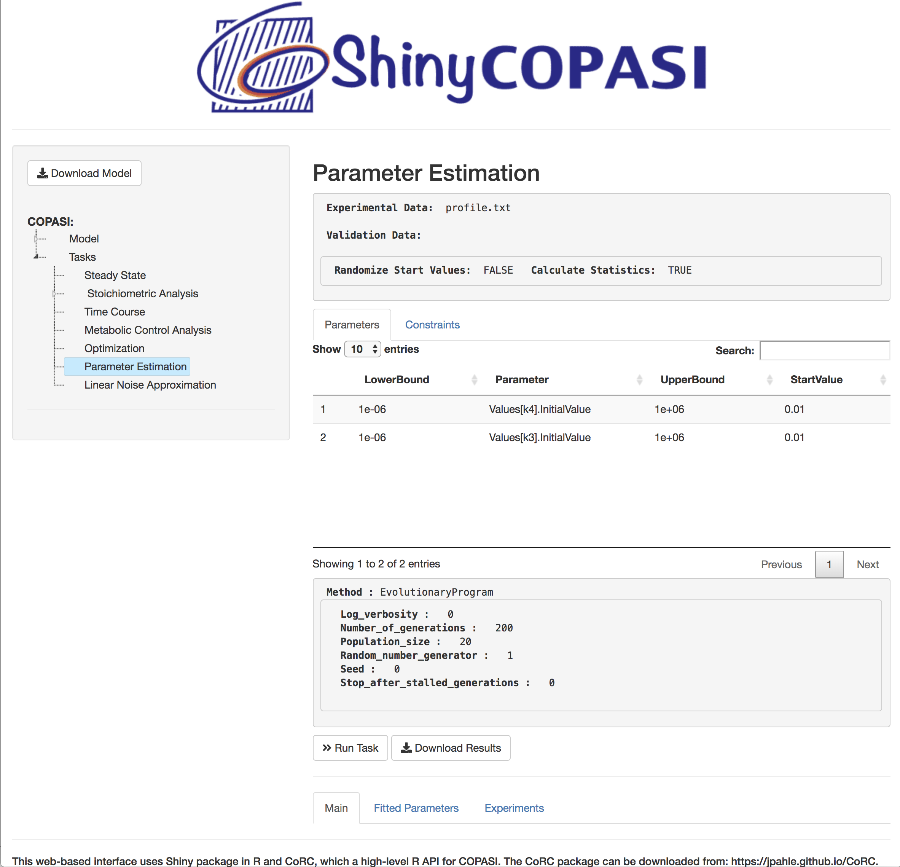
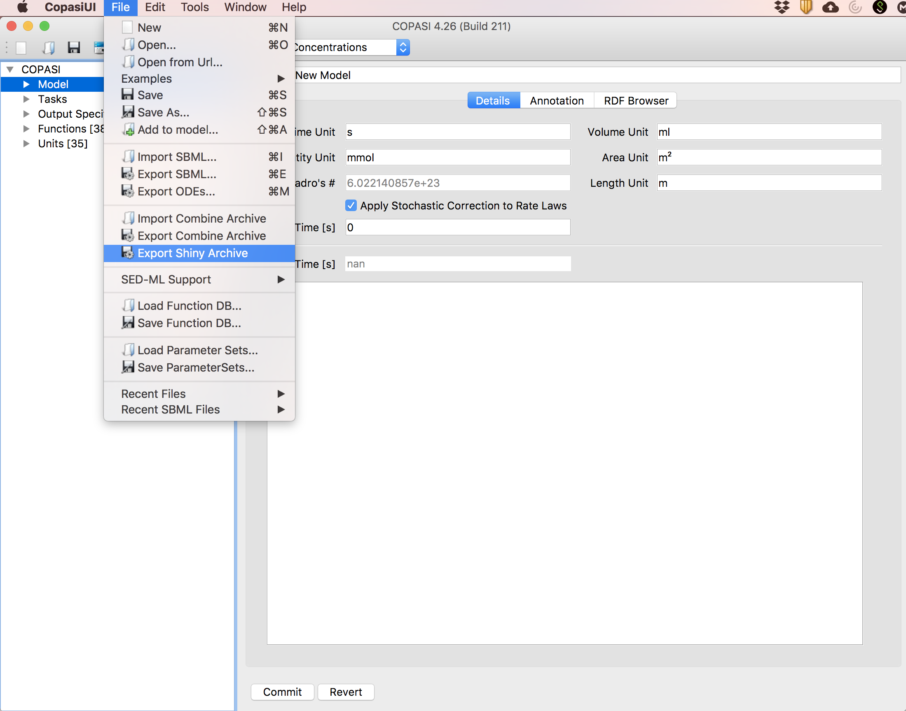

# ShinyCOPASI User Guide

## User Interface
ShinyCOPASI has an interface that is visually similar to COPASI. There are three distinct panels, namely *Selection*, *Options* and *Results*, as shown in Figure [1](#figureGeneric). The *Options* panel is dynamically updated based on the choice made in the *Selection* panel, and the *Results* panel gets updated upon execution of a task. In Figure [1](#figureGeneric), choosing *Time Course* in *Selection* panel updates the *Options* panel to display the options associated with *Time Course*  task. Furthermore, upon executing the *Time Course* task using the “Run Task" button, the *Results* panel shows the results. The details of these panels are described below.

Figure 1: *Screen-shot of the generic ShinyCOPASI interface that shows a time course plot of a model. The three panels are highlighted using the red
rectangles.*

### Selection

The selection panel allows loading or downloading a model. It also facilitates in choosing a specification of the model or a task that is to be executed on a model. The details are describes below:

#### Model Load/Download

The generic variant of ShinyCOPASI has a input option (*Load*) to load a model file in COPASI or standard SBML format (as seen in Figure [1](#figureGeneric)). For the models that have data files, multiple selection can also be made using this option. It has to be noted that, in its current form, models whose size greater than 30 MB cannot be loaded. For such models, standalone COPASI application should be preferred.

On the other hand, as the model-specific variant has its model loaded by default, *Download Model* option is available instead of the load option (shown in Figure [2](#figureModel)). This can be used to export the model along with its associated files.

Figure 2: *Screen-shot of a model-specific ShinyCOPASI interface that shows global quantities of the model. The load option of the generic ShinyCOPASI is replaced with a *Download Model* option. Selecting *Global Quantities* from the *Selection* panel updates the *Options* panel to display the global quantities of the model in a tabular form.*
#### Model Exploration

Like in COPASI, the model specifications can be explored using the *Model* option. Clicking on *Model* will reveal the specifications that can be explored further in the *Options* panel. The available specifications are: *Compartments*, *Species*, *Reactions*, *Global Quantities*, *Events*, and *Parameters*. For example, to see all the global parameters of the model, one needs to click *Model*, then click *Global Quantities* and see the details in *Options* panel. This is also illustrated in Figure [2](#figureModel).

Figure 3: *Screen-shot of a model-specific ShinyCOPASI interface that shows options panel of the parameter estimation task for a loaded model.*

#### Task Selection

ShinyCOPASI allows a subset of tasks available in COPASI. In both generic and model-specific variants, the following tasks can be executed.

  - *Steady State*: This task is to compute the steady state and Jacobian of the loaded model.

  - *Time Course*: Time-course simulation can be performed either with stochastic kinetics or with differential equations.

  - *Metabolic Control Analysis*: This is a special form of sensitivity analysis.

  - *Optimization*: This task allows optimization of pre-defined components of the model using one fo the available algorithms.

  - *Parameter Estimation*: This task allows estimating parameters that best fits the data using a range of diverse algorithms. This can be done over several different experiments simultaneously, including mixtures of steady-state and time course experiments. All these needs to be properly defined in the loaded model file.

  - *Linear Noise Approximation*: This task performs the analysis of stochasticity using the linear noise approximation that allows estimating variances and co-variances even in the presence of large numbers of particles.

### Options

The *Options* panel is dynamically updated based on the *Selection* panel. While the top space of this panel is reserved for errors and warnings,
remaining space is used to display various specifications/options for the selection made in *Selection* panel.

#### Model options

On clicking a specific model specification in the *Selection* panel, this panel displays the details of that specification in a tabular form, which are listed below:
- *Compartments*: Properties of the compartments, such as their name, types, dimensions, unit, and size, among others are displayed in a tabular form for the loaded model.

- *Species*: All the species along with their properties in a tabular form for the loaded model. An overview plot showing the initial concentrations of the species can also be seen by selecting
 *Overview* tab.

- *Reactions*: For the loaded model, all the reactions, their annotation and rate\_laws are displayed in a tabular form.

- *Global Quantities*: The global quantities are listed in a tabular form. One example of such instance is illustrated in Figure [2](#figureModel). Like *Species*, it has an *Overview* tab that plots the *initial\_value* of the quantities.

- *Events*: If they exist in a model, the details about the events are displayed in a tabular form.

- *Parameters*: For the loaded model, all the parameters, their mapping to reaction or the global quantities are listed in a tabular form. It also has an *Overview* tab which plots the parameters against their values.

- *Stoichiometry*: For the loaded model, the stoichiometric and the link matrices are displayed in tabular form.

#### Task options

For each of the tasks, the options are displayed along with *Run Task* and *Download Results* button.
The options are limited by their usage and availability in CoRC. A more extensive exploration for any of the tasks needs to be done with standalone COPASI. The task-specific options are listed below:
- *Steady State*: Choice on calculating the Jacobian, performing the stability analysis, and selecting the integration method can be made in this panel. The options to tune the resolution and the derivation factor is also provided.

- *Time Course*: For time-course simulations, there are options to change the duration, interval size, start at steady state and to choose the algorithm. The available algorithms are:

    - LSODAR for ordinary differential equation modeling.

    - Gibson & Bruck’s version of Gillespie’s algorithm for exact stochastic kinetics.

    - Gillespie’s direct method for exact stochastic kinetics.

    - τ-leap algorithm for faster (approximate) stochastic kinetics.

    - Adaptive SSA/τ-leap algorithm for faster (approximate) stochastic kinetics.

    - Hybrid Runge-Kutta/SSA for hybrid simulations with stochastic kinetics and differential equations.

    - Hybrid LSODA/SSA for hybrid simulations with stochastic kinetics and differential equations.

    - Stochastic differential equations (RI5) solver.

- *Metabolic Control Analysis*: In this task, there are options to perform steady state analysis and tune the modulation factor. Furthermore, there are options to choose the Reder or Smallbone method.

- *Optimization*: Due to limited functionality of CoRC for this task, the pre-defined options are displayed in a read-only mode. More specifically, the expression to optimize, sub-task to optimize, parameters and constraints are displayed. It also displays the chosen optimization algorithm and its settings. As there is no options to tune, all these options need to be properly defined in the loaded model file. If needed, changes can only be made using the standalone COPASI application.

- *Parameter Estimation*: Like *Optimization* task, the options for this task is also limited by the available functions in CoRC. While there is no flexibility to tune any of the options, the displayed options include the names of experimental and validation data file, parameters and constraints. Furthermore, the algorithm as well as the settings set for the algorithms is also displayed.

- *Linear Noise Approximation*: For this task, there are options to perform steady state analysis and tune the resolution and the derivation factor. Furthermore, there are options to choose between the integration methods.

### Results

The *Results* panel is dynamically updated after a task is executed. The results are mostly shown in a tabular form (except time-course task where results can also be plotted). The task-specific results are as follows:

- *Steady State*: There are two result tables, namely *Steady State* and *Jacobian*. In *Steady State* tab, the steady-state concentrations of all species in the model are displayed. Also, the rate and transition time are displayed. If *Calculate Jacobian* is selected using the checkbox, *Jacobian* tab displays the Jacobian matrix for the loaded model.

- *Time Course*: For time-course simulations, there are two tabs, namely *Time Course* and *Plot*.  The *Time Course* tab displays the concentrations of species for each simulation time points. The *Plot* tab displays the plot of species against time. In addition, there is an option to choose/limit the species being displayed for both *Time Course* and *Plot* tabs.

- *Metabolic Control Analysis*: In this task, the scaled elasticities of the species for all the reactions in the model are displayed in a tabular form.

- *Optimization*: Like most of the other tasks, the results panel for *Optimization* task has two tabs. The first tab, named *Main*, displays the summary of the optimization task as well as its computational statistics, like in COPASI. The second tab, named *Optimized Parameters*, displays the statistics on the best values of optimized parameters as well as their upper and lower bounds.

- *Parameter Estimation*: For this task, there are three tabs, namely *Main*, *Fitted Parameters* and *Experiments*. Like *Optimization* task, the first two tabs display the summary of this task and the statistics on the best values for fitted parameters, respectively. The *Experiments* tab displays the statistics on the goodness of fit to each of the experiments.

- *Linear Noise Approximation*: The covariance matix of all the species in the reaction network resulting from this analysis is displayed.

## Hosting and Deployment
Deploying ShinyCOPASI, like other shiny application, requires the installation of shiny server. Open Source Shiny Server serves the pupose and can be used to host multiple ShinyCOPASI applications on a single server. The pre-compiled binaries for Ubuntu 12.04 (or later), RedHat/CentOS 6 and 7, and SUSE Linux Enterprise Server 11+ along with detailed instructions for setting up an open-source shiny server is available at: <https://www.rstudio.com/products/shiny/download-server/>. Another useful resource is the shiny server GitHub page, at <https://github.com/rstudio/shiny-server>.

The model-specific variant can be exported using the newly-added *Export Shiny Archive* function in COPASI, shown in Figure [4](#figureExport). For a model loaded in COPASI, this function generates a folder with all the required files for model-specific ShinyCOPASI application. This folder can be directly transferred to the shiny server location.

Figure 4: *Screen-shot of the newly added *Export Shiny Archive* option in COPASI. This allows modelers to download a model-specific ShinyCOPASI
application.*
