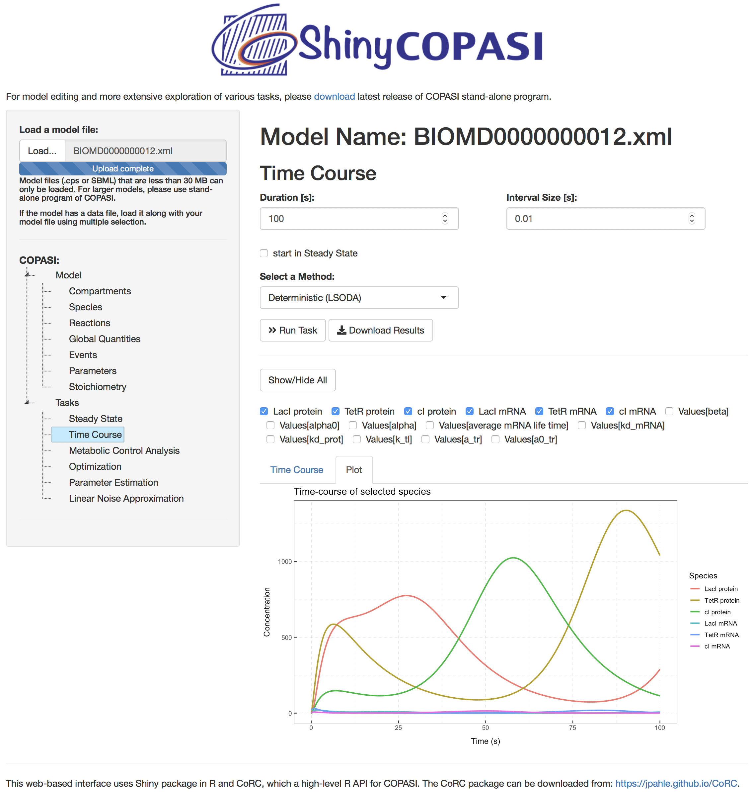

# Abstract

COPASI is a popular application for simulation and analysis of biochemical networks and their dynamics. While this software is widely used, it works as a standalone application and until now it was not possible for users to interact with its models through the web. We built ShinyCOPASI, a web-based application that allows COPASI models to be explored through a web browser. ShinyCOPASI was written in R with the CoRC package, which provides a high-level R API for COPASI, and the Shiny package to expose it as a web application. The web view provided by ShinyCOPASI follows a similar interface to the standalone COPASI and allows users to explore the details of a model, as well as running a subset of the tasks available in COPASI from within a browser. A generic version allows users to load model files from their computer, while another one pre-loads a specific model from the server and may be useful to provide web access to published models. The application is available at: [http://shiny.copasi.org/](http://shiny.copasi.org/).

# Introduction

COPASI is a stand-alone software application for simulation and analysis of biochemical networks and their dynamics that includes powerful algorithms yet is based on a graphical user interface that makes it easy to use without expertise in programming or mathematics [@Hoops2006;@Bergmann2017]. It supports models in the SBML standard [@Hucka2003] and can simulate their behavior using ordinary differential equations, stochastic differential equations, or Gillespie's stochastic simulation algorithm. Recently, COPASI was shown to be the most efficient stochastic simulators that allows data post-processing and analysis [@Gupta2018]. 

COPASI has been used in published research in many fields of biology and chemistry [@CopasiResearch] and yet there is no easy way to expose those models to readers online in a functional way. Currently readers need to install COPASI in their computers and download supplementary files to be able to examine models published as supplementary data. A light-weight web interface to allow exploration of COPASI models is highly desirable. Such a tool would allow readers of research articles to quickly interact with  published models, including running some simulations or analyses (those that are not time intensive). It would additionally facilitate the dissemination of models and their associated results, and promote reproducibility [@Mendes2018].

Here, we present ShinyCOPASI, a web-based application that provides online access to COPASI models. It exists in two variants, a _generic_ interface at [http://shiny.copasi.org/](http://shiny.copasi.org/) that allows users to load and interact with any COPASI or SBML file, and a _specialized_ version to be mounted on any web site and which provides access to a predetermined model file. The latter is designed to allow exposing specific model files on web sites, for example those that are included in research publications. This follows the approach pioneered by JWS-online [@Olivier2004] but specifically for COPASI models and without requiring any recoding.

# Implementation

ShinyCOPASI is implemented in the R programming environment [@R-base] and depends on several packages that are automatically installed and loaded when it is executed. The ability of ShinyCOPASI to interact with users through a web interface is provided by the _Shiny_ package, which is a web application framework for R [@R-shiny]. It allows building interactive web applications using reactive bindings between inputs and outputs as well as  extensive pre-built widgets. The _CoRC_ package (COPASI R Connector) is also an important library. This package provides an API to access to the functionality of COPASI from within the R language and is available from [https://github.com/jpahle/CoRC](https://github.com/jpahle/CoRC). Other packages used include _shinyTree_ for the selection tree panel, _ggplot2_ package to generate result plots, _DT_ and  _formattable_ to display and format tables. More details about thse packages can be found in the User Guide. ShinyCOPASI uses the _xml_ package to read the settings of optimization and parameter estimation tasks directly from the files. 

The generic version of ShinyCOPASI is available at [http://shiny.copasi.org/](http://shiny.copasi.org/). The model-specific version is designed to be hosted and deployed in third party web servers; these will require to have installed the R system, a shiny server, as well as CoRC and the other dependencies. Detailed instructions for setting up a shiny server are available in the User Guide. Once the shiny server is set up, model-specific ShinyCOPASI interfaces can be deployed to allow access from web browsers. Multiple model-specific ShinyCOPASI instances can be deployed in the same shiny server.

# Interface

ShinyCOPASI's interface (Figure \ref{interface}) mimics that of the COPASI standalone application as much as possible. It includes three panels: one to choose model and tasks, another to display the task specifications, and another to display results. The generic and model-specific versions differ only in the model selection panel: the generic version allows the user to load a model (in COPASI .cps or SBML formats), while the model-specific version immediately loads a model hosted on the server. Additionally, the latter also allows downloading the corresponding .cps file.

*Figure 1: ShinyCOPASI user interface showing results of a time course simulation for the repressilator model [@Elowitz2000], which was obtained from Biomodels in SBML format.*

The leftmost panel allows the user to visualize the _Model_ components, namely  _Compartments_, _Species_, _Reactions_, _Parameters_, _Global Quantities_ and _Events_. Note that this interface does not allow modifications to be made on the model. The _Tasks_ section includes a subset of COPASI tasks, those currently supported by CoRC: _Steady State_, _Stoichiometry_, _Time Course_, _Metabolic Control Analysis_, _Optimization_, _Parameter Estimation_ and _Linear Noise Approximation_. 

The top-right panel displays the model specifications and task settings, depending on the choice made in the _Selection_ panel. Model details are displayed in a tabular form. For species, global quantities, and parameters an overview plot is also available which provides quick overview of magnitude differences between these items. When one task is selected, this panel displays its settings, a button to _run_ the task and another to _download_ its results (in .csv format). The bottom-right panel displays results of the corresponding task in a tabular form. In case of multiple results, these are displayed as multiple tables. For the _time course_ task, there is an additional option to plot the results (see Figure \ref{interface}) as well as option to limit the number of species being displayed. 

To generate a model-specific version of ShinyCOPASI requires first loading the model in the regular standalone COPASI application and using a new option in the file menu: `Export Shiny Archive`  (Fig. 1 in the User Guide). This generates a ZIP file containing all the files required for deployment in a shiny server installation, which will then provide access to that model alone. The details on hosting and deployment can be found in the User Guide.

# Discussion

Our aim with ShinyCOPASI is to facilitate making COPASI (and SBML) models available on the web with a certain level of interactivity, including running some simulations and analyses. It is useful to allow quick inspection of a model online without requiring local software installation. This is, however, not intended to substitute the regular COPASI application, which is still required for large models, time intensive simulations and any kind of model editing.

The model-specific variant of ShinyCOPASI is particularly attractive to provide online access to published models. An example of this use case has been deployed in our group's research web site at [http://www.comp-sys-bio.org/models.html](http://www.comp-sys-bio.org/models.html), where several of our published models are presented using this tool. We hope that this will encourage model authors to provide web access to their models.

# Acknowledgements

We are grateful to the National Institutes of Health for funding this work under grant GM080219. We thank J. Pahle and J. Förster for CoRC.

# References
